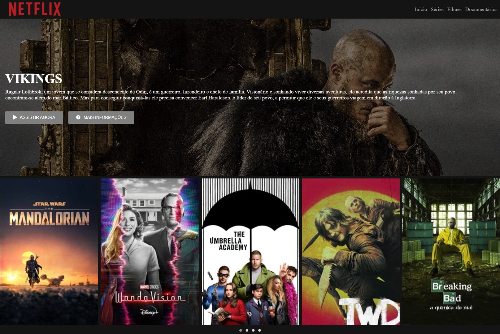

<h1 align="center">💻 Tela inicial da Netflix</h1>

  <strong>Recriado a página inicial da Netflix, como projeto de curso Avanade Angular Developer da Digital Innovation One</strong>

  

### Site 💻

- [Tela inicial da Netflix](https://netflix-projeto.netlify.app/)

## Linguagens: 🚀
- HTML
- CSS
- JavaScript

